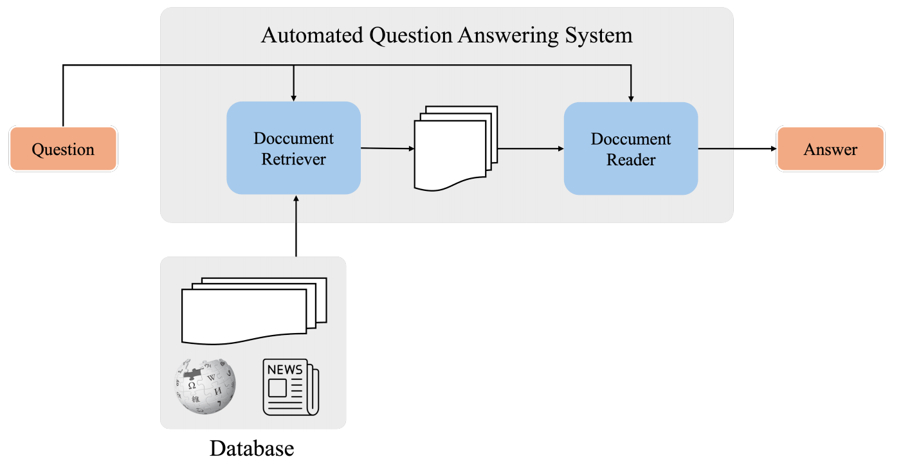
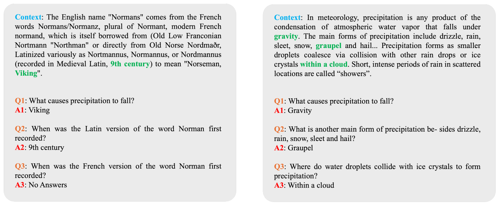
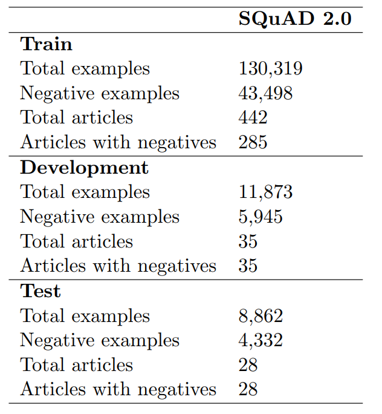
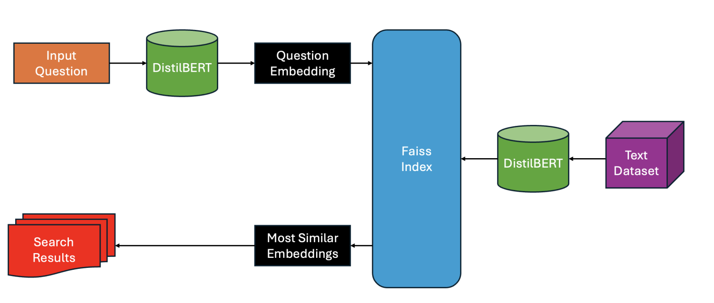

<h1>End-to-End Automated Question Answering System</h1>

<h2>I. Introduction</h2>

  In this project, we focus on developing an end-to-end automated question-answering system capable of answering questions on any topic. The system we implement in this project comprises two main components: the Retriever and the Reader, aiming to build a comprehensive system capable of extracting information from text and providing answers to questions based on the content of the passage.

  
  
<em>Figure 1: Overview of System</em>

<h2>II. Methodology</h2>

<h3>1. Implementation</h3>

  We will build the program based on the SQuAD2.0 dataset, a reading comprehension dataset, the FAISS vector database, and the BERT model to perform specific tasks within the program. The program's input and output are as follows:

<ul>
  <li><strong>Input</strong>: A question.</li>
  <li><strong>Output</strong>: The corresponding answer.</li>
</ul>

<h3>2. Dataset</h3>

  The SQuAD2.0 Stanford Question Answering Dataset (SQuAD) is a reading comprehension dataset that includes various passages on multiple topics, each accompanied by a set of short questions. Table 1 provides a detailed description of the SQuAD2.0 dataset structure.

  
  
<em>Figure 2: Illustrative example of the SQuAD2.0 dataset.</em>

  
  
<em>Table 1: Detailed structure of the SQuAD2.0 dataset.</em>

<h3>3. Reader (DistilBERT)</h3>

  First, we will build the Reader model, which serves as the question-answering (QA) model in this project. 
  You can see it in <code>[solution]_DistilBERT_QA.ipynb</code>

<h3>4. Retriever: Faiss (Facebook AI Similarity Search)</h3>

  Faiss is a library developed by the Facebook AI Research Team that supports high-speed, high-accuracy vector similarity search and clustering. Here, we use Faiss as the Retriever module for our end-to-end QA system. Its purpose is to find the most relevant context for the input question. We will configure Faiss as follows:

<ul>
  <li>(a) Using the SQuAD2.0 dataset, we will build a database with an additional column representing the vector embeddings of each question.</li>
  <li>(b) Embed the questions using DistilBERT.</li>
  <li>(c) Perform similarity search between the vectors in the new column and the input question's vector to identify the most relevant context.</li>
</ul>

The processing workflow of Faiss in this project can be summarized in the image below:

  
  
<em>Figure 3: Illustration of the steps for building a vector database with Faiss.</em>

You can see it in <code>[solution]_HF_Faiss_Search.ipynb</code>

